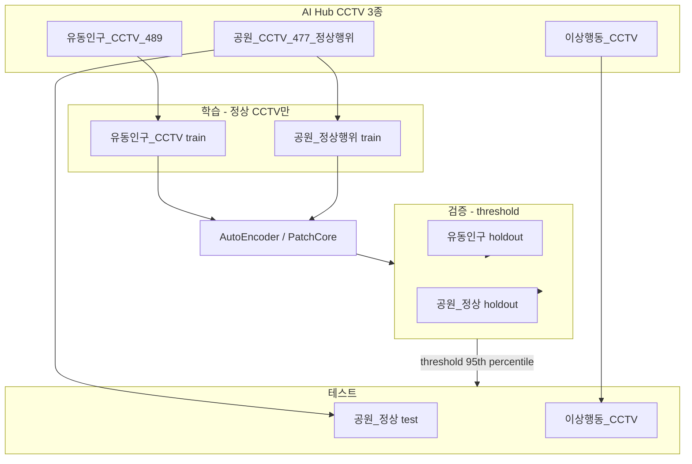

# 컴퓨터 비전 기말 프로젝트 계획서

## 1. 프로젝트 주제

AI Hub CCTV 데이터와 PatchCore를 활용한 이상행동 탐지 시스템 개발

---

## 2. 프로젝트 배경

최근 CCTV를 활용한 범죄 예방 및 안전 관리의 중요성이 증가하고 있다. 본 프로젝트에서는 정상 행동과 이상 행동을 구분할 수 있는 이상탐지(Anomaly Detection) 모델을 구축하고, 컴퓨터 비전 수업에서 학습한 AutoEncoder, PatchCore, ResNet, Vision Transformer(ViT)를 활용하여 성능을 비교 분석한다.

본 프로젝트는 **정상 데이터만으로 학습**한 뒤, 새로운 CCTV 영상이 입력되었을 때 **영상 단위**로 정상/이상을 판별하는 것을 목표로 한다.

---

## 3. 사용 데이터

### 3.1 AI Hub CCTV 데이터 3종 (본 프로젝트 핵심)

본 프로젝트는 **AI Hub에서 제공하는 CCTV 영상 데이터 3종**을 사용한다.  
이상탐지는 **학습 시 정상 CCTV만** 사용하고, **테스트 시 정상·이상 CCTV**를 함께 평가한다.

| # | AI Hub 데이터셋 | dataSetSn | 프로젝트 폴더 | 역할 | 라벨 |
|---|----------------|-----------|---------------|------|------|
| 1 | **CCTV 이상행동 영상** | (이용신청 데이터셋) | `anomaly/` | **이상 테스트** | 이상 |
| 2 | **[유동인구 분석을 위한 CCTV 영상](https://aihub.or.kr/aihubdata/data/view.do?dataSetSn=489)** | 489 | `pedestrian_cctv/` | **정상 학습** (상권 CCTV) | 정상 |
| 3 | **[공원 주요시설 및 불법행위 감시 CCTV](https://aihub.or.kr/aihubdata/data/view.do?dataSetSn=477)** | 477 | `park_normal/` | **정상 학습 / val / test** | 정상 |

> **이상행동 데이터셋에는 정상 영상이 없음** → 정상 CCTV는 **유동인구(2)** + **공원 정상행위(3)** 로 확보.



**다운로드:** AI Hub `aihubshell` (마이페이지 dataset key)

```bash
aihubshell -mode d -datasetkey <KEY> -localdir data/raw/downloads/anomaly
aihubshell -mode d -datasetkey <KEY> -localdir data/raw/downloads/pedestrian
aihubshell -mode d -datasetkey <KEY> -localdir data/raw/downloads/park
```

---

### 3.2 데이터셋 상세

#### (1) CCTV 이상행동 영상 — `anomaly/`

- **역할:** **이상 테스트 전용** (학습·임계값 설정에 사용하지 않음)
- **이상 행동 예시:** 폭행, 절도, 침입, 실신, 기물파손 등
- **전처리:** 1초당 1프레임 추출 → 영상 단위 label=1

#### (2) 유동인구 분석 CCTV — `pedestrian_cctv/` (dataSetSn **489**)

- **규모:** 7개 상권, 3분 클립 6,600개 (약 330시간) — **EC2 100GiB 한계로 상권·클립 샘플링 권장**
- **촬영:** 동래역, 자갈치, 중앙동, 사상 터미널, 사직 야구장, 서면, 연산동 등
- **라벨:** 사람 bbox (유동인구 분석) — **암묵적 정상**
- **역할:** 상권 CCTV 정상 행동 **학습 보조** (Memory Bank / AutoEncoder)
- **주의:** 테스트 정상으로는 사용하지 않음 (공원 정상행위 사용)

#### (3) 공원 CCTV — `park_normal/` (dataSetSn **477**)

- **규모:** **정상행위** 480클립 (~10시간), 3 FPS  
  (동일 데이터셋 불법행위 6,780클립은 **사용하지 않음**)
- **촬영:** 10곳 이상 공원, CCTV 화각
- **라벨:** JSON — `정상행위` / `불법행위` → **정상행위만 필터링**
- **역할:**
  - **학습:** 정상행위 클립
  - **검증:** holdout → 임계값(threshold)
  - **테스트:** holdout → **정상 CCTV 테스트**
- **정상 행동 예시:** 산책, 벤치 휴식, 일반 보행, 시설물 정상 이용

**정리 스크립트:** `python -m src.preprocess.organize_aihub` (정상행위만 자동 필터)

---

### 3.3 (선택) UCF101 / KTH — 일반 행동 보조

> **필수 아님.** AI Hub 3종만으로 실험 가능. 일반 행동 다양성 보강 시에만 추가.

| 데이터 | 역할 |
|--------|------|
| UCF101 | 선택적 정상 학습 (`configs/normal_classes.yaml`) |
| KTH Action | 선택적 정상 학습 |

---

### 3.4 Train / Val / Test Split

**원칙:** 영상 ID 단위 split (같은 영상의 프레임이 train/test에 섞이지 않음)

| Split | AI Hub 정상 소스 | AI Hub 이상 | 용도 |
|-------|------------------|-------------|------|
| **Train** | 유동인구 CCTV (70%) + 공원 정상행위 (70%) | — | AE / PatchCore 학습 |
| **Val** | 유동인구 (15%) + 공원 정상 (15%) | — | threshold (95th percentile) |
| **Test** | 공원 정상 (15%) | **이상행동 CCTV (전체)** | AUROC, F1 등 |

**공원 정상 480클립 분할 예시:**

| Split | 클립 수 (약) |
|-------|-------------|
| Train | 336 (70%) |
| Val | 72 (15%) |
| Test | 72 (15%) |

---

### 3.5 데이터 다운로드 (aihubshell)

| 데이터셋 | AI Hub 페이지 | 저장 경로 |
|----------|---------------|-----------|
| CCTV 이상행동 | 마이페이지 이용신청 데이터셋 | `data/raw/anomaly/` |
| 유동인구 분석 CCTV | [dataSetSn=489](https://aihub.or.kr/aihubdata/data/view.do?dataSetSn=489) | `data/raw/pedestrian_cctv/` |
| 공원 CCTV (정상행위) | [dataSetSn=477](https://aihub.or.kr/aihubdata/data/view.do?dataSetSn=477) | `data/raw/park_normal/` |

```bash
python -m src.preprocess.setup_dirs
python -m src.preprocess.organize_aihub --source data/raw/downloads/park --dataset park_normal
python -m src.preprocess.organize_aihub --source data/raw/downloads/pedestrian --dataset pedestrian_cctv
python -m src.preprocess.organize_aihub --source data/raw/downloads/anomaly --dataset anomaly
```

---

### 3.6 데이터 한계 (발표·보고서에 명시)

1. **장면 차이:** 공원 정상(야외) vs 이상행동(실내/거리 등) — 촬영 환경 불일치 가능
2. **유동인구 데이터:** 상권 장면, 이상 라벨 없음 → 학습 보조용으로만 사용
3. **클래스 불균형:** 공원 정상 480클립 vs 이상행동 수천 클립 — AUROC를 주 지표로, Accuracy 단독 해석 주의
4. **연출 데이터:** AI Hub 공원·이상행동 일부는 연출 수집 — 실제 CCTV와 차이 존재

---

## 4. 데이터 전처리

### 1단계: 영상 프레임 추출

OpenCV를 이용하여 영상을 이미지로 변환 (1초당 1프레임).

```python
cap = cv2.VideoCapture(video_path)
```

- AI Hub 공원/유동인구: 원본 3 FPS → 1 fps 추출 시 간격 조정
- metadata.csv 생성: `video_id`, `dataset`, `label`, `split`, `frame_path`

### 2단계: 이미지 크기 통일

224 × 224 크기로 변환.

```python
transforms.Resize((224, 224))
```

### 3단계: 정규화

ImageNet 평균 및 표준편차 적용.

```python
transforms.Normalize(
    mean=[0.485, 0.456, 0.406],
    std=[0.229, 0.224, 0.225]
)
```

### 4단계: 영상 단위 점수 집계

프레임별 anomaly score → 영상 점수:

| 방법 | 공식 | 비고 |
|------|------|------|
| Max pooling (기본) | `video_score = max(frame_scores)` | 이상 구간 1프레임만 있어도 탐지 |
| Top-k mean | 상위 k% 프레임 평균 | 노이즈에 robust (ablation) |
| Percentile (95th) | 95 백분위수 | Max보다 안정적 (ablation) |

**파이프라인:**

```text
Video → FrameExtraction(1fps) → PerFrameScore → VideoAggregation(max) → Normal/Anomaly
```

- **AutoEncoder:** 프레임별 재구성 MSE → 영상 max
- **PatchCore:** patch kNN 거리 → 프레임 max → 영상 max

### 5단계: 임계값(Threshold) 설정

| 단계 | 데이터 | 방법 |
|------|--------|------|
| 학습 | train split, label=0 (정상만) | AE / PatchCore 학습 |
| 검증 | val split, label=0 (공원 정상 + 유동인구 holdout) | score **95th percentile** → threshold |
| 테스트 | test split (공원 정상 + AI Hub 이상) | threshold **고정** 후 1회 평가 |

> 검증에 이상 데이터를 사용하지 않음 (unsupervised threshold). 테스트 라벨로 threshold 재조정 금지.

---

## 5. 모델 구성

### 실험 1: AutoEncoder

- 정상 데이터만 학습 (**유동인구 CCTV + 공원 정상행위**)
- **Encoder:** Conv 5 blocks (224→7), latent dim 128
- **Decoder:** 대칭 Deconv 구조
- **Loss:** MSE | **Optimizer:** Adam, lr=1e-3, batch 32, epoch 50 (early stopping)
- **Score:** 프레임 MSE → 영상 max

### 실험 2: PatchCore + ResNet18

| 항목 | 설정 |
|------|------|
| Backbone | `torchvision.models.resnet18(pretrained=True)` |
| Feature | layer2 + layer3 concat |
| Memory Bank | 정상 train feature + coreset 10% |
| kNN | k=9, L2 거리 |
| Score | patch kNN max → 프레임 max → 영상 max |

### 실험 3: PatchCore + ViT

| 항목 | 설정 |
|------|------|
| Backbone | `timm` ViT-B/16 |
| Feature | patch token (cls 제외) |
| Memory Bank / kNN | ResNet18과 동일 |

> ViT는 GPU 메모리·시간 3~5배 소요. g5.xlarge 권장.

**비교 지표:** AUROC (주), Accuracy, Precision, Recall, F1 Score

---

## 6. 실험 환경

- AWS EC2: g4dn.xlarge 또는 g5.xlarge
- Python 3.10, PyTorch, OpenCV, NumPy, Scikit-learn, Matplotlib

---

## 7. 프로젝트 진행 순서

| 주차 | 작업 |
|------|------|
| 1주 | `aihubshell` — **AI Hub 3종** 다운로드, 공원 **정상행위/불법행위** 라벨 확인 |
| 2주 | 프레임 추출, metadata.csv, **영상 ID 기준 train/val/test split** |
| 3주 | AutoEncoder + 영상 집계 + threshold tuning |
| 4주 | PatchCore + ResNet18 |
| 5주 | PatchCore + ViT, 성능 비교 |
| 6주 | 결과 정리, domain gap 한계 논의, 발표 자료 |

---

## 8. 성능 평가

### 평가 지표

| 지표 | 설명 | 용도 |
|------|------|------|
| **AUROC** | threshold 무관 ROC 곡선 아래 면적 | **주 지표** |
| Accuracy | (TP+TN) / 전체 | 보조 (불균형 시 주의) |
| Precision | TP / (TP+FP) | 오탐율 |
| Recall | TP / (TP+FN) | 미탐율 |
| F1 | Precision·Recall 조화평균 | 종합 |

- Confusion Matrix (정상/이상 2×2)
- 정상 vs 이상 **score 분포 히스토그램**
- ROC Curve

### 평가 단위

- **영상 단위** — 각 영상 1개의 score, 1개의 label
- 프레임 score → `max` 또는 `percentile_95` 집계 후 평가

### Threshold 설정 및 적용

1. **Val:** 공원 정상 + 유동인구 holdout 영상 score 수집
2. **Threshold:** Val 정상 score의 **95th percentile** (config: `threshold_percentile: 95`)
3. **Test:** 고정 threshold로 `score >= threshold` → 이상 판정
4. **출력:** `outputs/results/{model}/metrics.json`, confusion matrix, histogram, ROC

### 테스트 구성

| | 공원 정상 (Test) | AI Hub 이상행동 (Test) |
|--|------------------|------------------------|
| Label | 0 (정상) | 1 (이상) |
| 기대 | score < threshold | score ≥ threshold |

### 해석 주의사항

- Accuracy만 높아도 Recall이 낮을 수 있음 (이상 샘플 적을 때)
- 공원 정상 vs 이상행동 CCTV 간 **domain gap** 존재 → AUROC 해석 시 한계 명시
- 영상 집계 방식(max vs percentile)에 따라 Recall/Precision trade-off 발생

---

## 9. 기대 효과

- AutoEncoder vs PatchCore 성능 비교
- ResNet vs ViT backbone 비교
- **AI Hub CCTV 3종** (이상행동 + 유동인구 + 공원 정상) 기반 이상탐지 파이프라인
- 실제 CCTV 환경에 적용 가능한 이상행동 탐지 파이프라인 구현

---

## 10. 최종 목표

**AI Hub CCTV 3종**(이상행동, 유동인구 분석, 공원 정상행위)을 활용하여, 정상 CCTV만 학습한 뒤 새로운 영상이 입력되었을 때 **영상 단위**로 정상/이상을 판단할 수 있는 이상행동 탐지 시스템을 구현한다.
